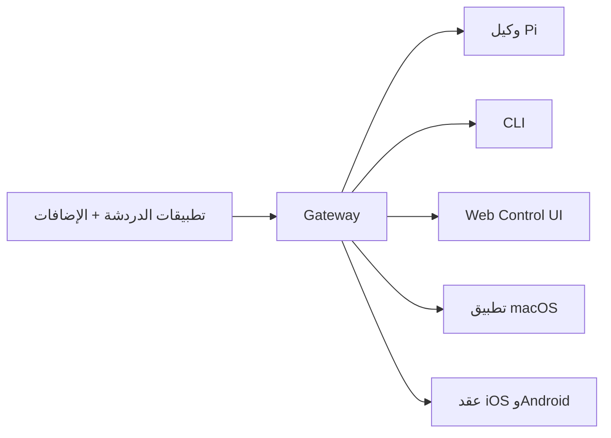

---
read_when:
  - تقديم OpenClaw للمستخدمين الجدد
summary: "OpenClaw هو بوابة متعددة القنوات لوكلاء الذكاء الاصطناعي تعمل على أي نظام تشغيل."
title: "OpenClaw"
x-i18n:
  generated_at: "2026-02-08T22:00:00Z"
  model: claude-sonnet-4
  provider: pi
  source_hash: 22725fdce9eafb337e9eb36958644009aa4a9f630e3a251c800cf921a987cb1c
  source_path: index.md
  workflow: 15
---

# OpenClaw 🦞

<p align="center">
    
    
</p>

> _"قَشِّر! قَشِّر!"_ — على الأرجح جراد بحر فضائي

<p align="center">
  <strong>بوابة لوكلاء الذكاء الاصطناعي على أي نظام تشغيل: WhatsApp وTelegram وDiscord وiMessage والمزيد.</strong><br />
  أرسل رسالة، واحصل على رد من الوكيل أينما كنت. تضيف الإضافات دعم Mattermost والمزيد.
</p>

<Columns>
  <Card title="ابدأ" href="/start/getting-started" icon="rocket">
    ثبّت OpenClaw وشغّل Gateway في دقائق.
  </Card>
  <Card title="شغّل المعالج" href="/start/wizard" icon="sparkles">
    إعداد موجّه باستخدام `openclaw onboard` وتدفقات الاقتران.
  </Card>
  <Card title="افتح Control UI" href="/web/control-ui" icon="layout-dashboard">
    شغّل لوحة التحكم في المتصفح للدردشة والإعدادات والجلسات.
  </Card>
</Columns>

## ما هو OpenClaw؟

OpenClaw هو **بوابة مستضافة ذاتياً** تربط تطبيقات المحادثة المفضلة لديك — WhatsApp وTelegram وDiscord وiMessage والمزيد — بوكلاء البرمجة بالذكاء الاصطناعي مثل Pi. تشغّل عملية Gateway واحدة على جهازك (أو خادم)، وتصبح الجسر بين تطبيقات المراسلة ومساعد ذكاء اصطناعي متاح دائماً.

**لمن هو؟** المطورون والمستخدمون المتقدمون الذين يريدون مساعد ذكاء اصطناعي شخصي يمكنهم مراسلته من أي مكان — دون التخلي عن التحكم في بياناتهم أو الاعتماد على خدمة مستضافة.

**ما الذي يميزه؟**

- **مستضاف ذاتياً**: يعمل على أجهزتك، قواعدك أنت
- **متعدد القنوات**: بوابة واحدة تخدم WhatsApp وTelegram وDiscord والمزيد في آن واحد
- **مصمم للوكلاء**: مبني لوكلاء البرمجة مع استخدام الأدوات والجلسات والذاكرة والتوجيه متعدد الوكلاء
- **مفتوح المصدر**: ترخيص MIT، بقيادة المجتمع

**ماذا تحتاج؟** Node 22+، ومفتاح API (يُنصح بـ Anthropic)، و5 دقائق.

## كيف يعمل



Gateway هو المصدر الوحيد للحقيقة للجلسات والتوجيه واتصالات القنوات.

## القدرات الرئيسية

<Columns>
  <Card title="بوابة متعددة القنوات" icon="network">
    WhatsApp وTelegram وDiscord وiMessage بعملية Gateway واحدة.
  </Card>
  <Card title="قنوات الإضافات" icon="plug">
    أضف Mattermost والمزيد بحزم الإضافات.
  </Card>
  <Card title="توجيه متعدد الوكلاء" icon="route">
    جلسات معزولة لكل وكيل أو workspace أو مرسل.
  </Card>
  <Card title="دعم الوسائط" icon="image">
    أرسل واستقبل الصور والصوت والمستندات.
  </Card>
  <Card title="Web Control UI" icon="monitor">
    لوحة تحكم في المتصفح للدردشة والإعدادات والجلسات والعقد.
  </Card>
  <Card title="العقد المحمولة" icon="smartphone">
    اقرن عقد iOS وAndroid مع دعم Canvas.
  </Card>
</Columns>

## البدء السريع

<Steps>
  <Step title="تثبيت OpenClaw">
    ```bash
    npm install -g openclaw@latest
    ```
  </Step>
  <Step title="الإعداد وتثبيت الخدمة">
    ```bash
    openclaw onboard --install-daemon
    ```
  </Step>
  <Step title="اقتران WhatsApp وتشغيل Gateway">
    ```bash
    openclaw channels login
    openclaw gateway --port 18789
    ```
  </Step>
</Steps>

هل تحتاج إلى التثبيت الكامل وإعداد التطوير؟ راجع [البدء السريع](/start/quickstart).

## لوحة التحكم

افتح Control UI في المتصفح بعد تشغيل Gateway.

- الافتراضي المحلي: [http://127.0.0.1:18789/](http://127.0.0.1:18789/)
- الوصول عن بعد: [واجهات الويب](/web) و[Tailscale](/gateway/tailscale)

<p align="center">
  
</p>

## الإعداد (اختياري)

يوجد ملف الإعداد في `~/.openclaw/openclaw.json`.

- إذا **لم تفعل شيئاً**، يستخدم OpenClaw ثنائي Pi المدمج في وضع RPC مع جلسات لكل مرسل.
- إذا أردت تقييد الوصول، ابدأ بـ `channels.whatsapp.allowFrom` و(للمجموعات) قواعد الإشارة.

مثال:

```json5
{
  channels: {
    whatsapp: {
      allowFrom: ["+15555550123"],
      groups: { "*": { requireMention: true } },
    },
  },
  messages: { groupChat: { mentionPatterns: ["@openclaw"] } },
}
```

## ابدأ من هنا

<Columns>
  <Card title="مراكز التوثيق" href="/start/hubs" icon="book-open">
    جميع المستندات والأدلة، منظمة حسب حالة الاستخدام.
  </Card>
  <Card title="الإعداد" href="/gateway/configuration" icon="settings">
    إعدادات Gateway الرئيسية والرموز وإعداد المزودين.
  </Card>
  <Card title="الوصول عن بعد" href="/gateway/remote" icon="globe">
    أنماط الوصول عبر SSH وtailnet.
  </Card>
  <Card title="القنوات" href="/channels/telegram" icon="message-square">
    إعداد خاص بالقنوات لـ WhatsApp وTelegram وDiscord والمزيد.
  </Card>
  <Card title="العقد" href="/nodes" icon="smartphone">
    عقد iOS وAndroid مع الاقتران وCanvas.
  </Card>
  <Card title="المساعدة" href="/help" icon="life-buoy">
    حلول شائعة ونقطة انطلاق لاستكشاف الأخطاء.
  </Card>
</Columns>

## اعرف المزيد

<Columns>
  <Card title="قائمة الميزات الكاملة" href="/concepts/features" icon="list">
    جميع إمكانيات القنوات والتوجيه والوسائط.
  </Card>
  <Card title="التوجيه متعدد الوكلاء" href="/concepts/multi-agent" icon="route">
    عزل مساحات العمل والجلسات لكل وكيل.
  </Card>
  <Card title="الأمان" href="/gateway/security" icon="shield">
    الرموز وقوائم السماح وضوابط الأمان.
  </Card>
  <Card title="استكشاف الأخطاء" href="/gateway/troubleshooting" icon="wrench">
    تشخيصات Gateway والأخطاء الشائعة.
  </Card>
  <Card title="حول المشروع" href="/reference/credits" icon="info">
    أصول المشروع والمساهمون والترخيص.
  </Card>
</Columns>
