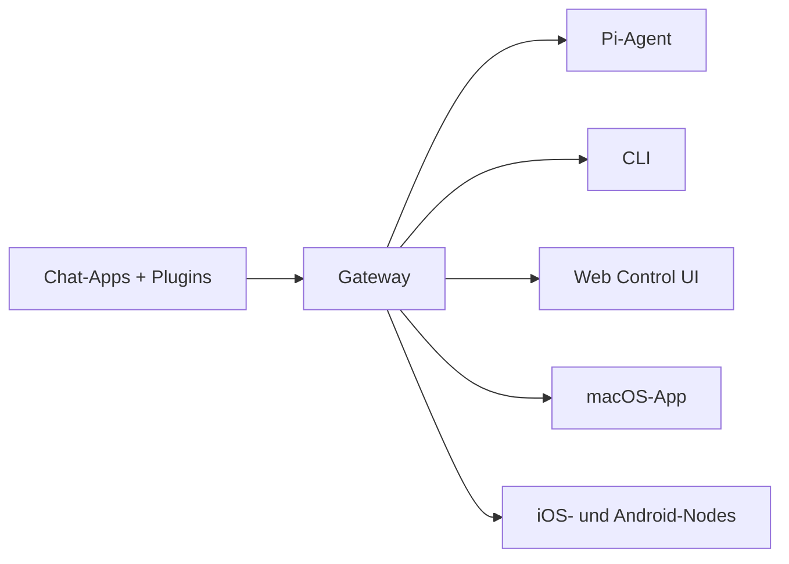

---
read_when:
  - OpenClaw neuen Benutzern vorstellen
summary: "OpenClaw ist ein Multi-Channel-Gateway für KI-Agenten, das auf jedem Betriebssystem läuft."
title: "OpenClaw"
x-i18n:
  generated_at: "2026-02-08T22:00:00Z"
  model: claude-sonnet-4
  provider: pi
  source_hash: 22725fdce9eafb337e9eb36958644009aa4a9f630e3a251c800cf921a987cb1c
  source_path: index.md
  workflow: 15
---

# OpenClaw 🦞

<p align="center">
    
    
</p>

> _"HÄUTEN! HÄUTEN!"_ — Wahrscheinlich ein Weltraum-Hummer

<p align="center">
  <strong>Gateway für KI-Agenten auf jedem OS: WhatsApp, Telegram, Discord, iMessage und mehr.</strong><br />
  Sende eine Nachricht, erhalte eine Agenten-Antwort aus der Hosentasche. Plugins fügen Mattermost und mehr hinzu.
</p>

<Columns>
  <Card title="Loslegen" href="/start/getting-started" icon="rocket">
    Installiere OpenClaw und starte das Gateway in wenigen Minuten.
  </Card>
  <Card title="Wizard starten" href="/start/wizard" icon="sparkles">
    Geführte Einrichtung mit `openclaw onboard` und Kopplungsabläufen.
  </Card>
  <Card title="Control UI öffnen" href="/web/control-ui" icon="layout-dashboard">
    Öffne das Browser-Dashboard für Chat, Konfiguration und Sitzungen.
  </Card>
</Columns>

## Was ist OpenClaw?

OpenClaw ist ein **selbst gehostetes Gateway**, das deine bevorzugten Chat-Apps — WhatsApp, Telegram, Discord, iMessage und mehr — mit KI-Coding-Agenten wie Pi verbindet. Du startest einen einzigen Gateway-Prozess auf deinem eigenen Rechner (oder einem Server), und er wird zur Brücke zwischen deinen Messaging-Apps und einem stets verfügbaren KI-Assistenten.

**Für wen ist es?** Entwickler und Power-User, die einen persönlichen KI-Assistenten wollen, den sie von überall erreichen können — ohne die Kontrolle über ihre Daten aufzugeben oder von einem gehosteten Dienst abhängig zu sein.

**Was macht es anders?**

- **Selbst gehostet**: läuft auf deiner Hardware, deine Regeln
- **Multi-Channel**: ein Gateway bedient WhatsApp, Telegram, Discord und mehr gleichzeitig
- **Agent-nativ**: gebaut für Coding-Agenten mit Tool-Nutzung, Sitzungen, Gedächtnis und Multi-Agent-Routing
- **Open Source**: MIT-Lizenz, Community-getrieben

**Was brauchst du?** Node 22+, einen API-Schlüssel (Anthropic empfohlen) und 5 Minuten.

## So funktioniert es



Das Gateway ist die einzige Quelle der Wahrheit für Sitzungen, Routing und Kanal-Verbindungen.

## Hauptfunktionen

<Columns>
  <Card title="Multi-Channel-Gateway" icon="network">
    WhatsApp, Telegram, Discord und iMessage mit einem einzigen Gateway-Prozess.
  </Card>
  <Card title="Plugin-Kanäle" icon="plug">
    Füge Mattermost und mehr mit Erweiterungspaketen hinzu.
  </Card>
  <Card title="Multi-Agent-Routing" icon="route">
    Isolierte Sitzungen pro Agent, Workspace oder Absender.
  </Card>
  <Card title="Medien-Unterstützung" icon="image">
    Sende und empfange Bilder, Audio und Dokumente.
  </Card>
  <Card title="Web Control UI" icon="monitor">
    Browser-Dashboard für Chat, Konfiguration, Sitzungen und Nodes.
  </Card>
  <Card title="Mobile Nodes" icon="smartphone">
    Kopple iOS- und Android-Nodes mit Canvas-Unterstützung.
  </Card>
</Columns>

## Schnellstart

<Steps>
  <Step title="OpenClaw installieren">
    ```bash
    npm install -g openclaw@latest
    ```
  </Step>
  <Step title="Onboarding und Service-Installation">
    ```bash
    openclaw onboard --install-daemon
    ```
  </Step>
  <Step title="WhatsApp koppeln und Gateway starten">
    ```bash
    openclaw channels login
    openclaw gateway --port 18789
    ```
  </Step>
</Steps>

Brauchst du die vollständige Installation und Entwickler-Einrichtung? Siehe [Schnellstart](/start/quickstart).

## Dashboard

Öffne die Control UI im Browser, nachdem das Gateway gestartet ist.

- Lokaler Standard: [http://127.0.0.1:18789/](http://127.0.0.1:18789/)
- Fernzugriff: [Web-Oberflächen](/web) und [Tailscale](/gateway/tailscale)

<p align="center">
  
</p>

## Konfiguration (optional)

Die Konfiguration befindet sich in `~/.openclaw/openclaw.json`.

- Wenn du **nichts tust**, verwendet OpenClaw die mitgelieferte Pi-Binary im RPC-Modus mit Sitzungen pro Absender.
- Wenn du den Zugriff einschränken willst, beginne mit `channels.whatsapp.allowFrom` und (für Gruppen) Erwähnungsregeln.

Beispiel:

```json5
{
  channels: {
    whatsapp: {
      allowFrom: ["+15555550123"],
      groups: { "*": { requireMention: true } },
    },
  },
  messages: { groupChat: { mentionPatterns: ["@openclaw"] } },
}
```

## Hier starten

<Columns>
  <Card title="Dokumentations-Hubs" href="/start/hubs" icon="book-open">
    Alle Dokumentation und Anleitungen, nach Anwendungsfall organisiert.
  </Card>
  <Card title="Konfiguration" href="/gateway/configuration" icon="settings">
    Zentrale Gateway-Einstellungen, Tokens und Provider-Konfiguration.
  </Card>
  <Card title="Fernzugriff" href="/gateway/remote" icon="globe">
    SSH- und Tailnet-Zugriffsmuster.
  </Card>
  <Card title="Kanäle" href="/channels/telegram" icon="message-square">
    Kanal-spezifische Einrichtung für WhatsApp, Telegram, Discord und mehr.
  </Card>
  <Card title="Nodes" href="/nodes" icon="smartphone">
    iOS- und Android-Nodes mit Kopplung und Canvas.
  </Card>
  <Card title="Hilfe" href="/help" icon="life-buoy">
    Häufige Lösungen und Einstiegspunkt zur Fehlerbehebung.
  </Card>
</Columns>

## Mehr erfahren

<Columns>
  <Card title="Vollständige Funktionsliste" href="/concepts/features" icon="list">
    Alle Kanal-, Routing- und Medien-Funktionen.
  </Card>
  <Card title="Multi-Agent-Routing" href="/concepts/multi-agent" icon="route">
    Workspace-Isolierung und Sitzungen pro Agent.
  </Card>
  <Card title="Sicherheit" href="/gateway/security" icon="shield">
    Tokens, Allowlists und Sicherheitskontrollen.
  </Card>
  <Card title="Fehlerbehebung" href="/gateway/troubleshooting" icon="wrench">
    Gateway-Diagnose und häufige Fehler.
  </Card>
  <Card title="Über uns und Credits" href="/reference/credits" icon="info">
    Projektherkunft, Mitwirkende und Lizenz.
  </Card>
</Columns>
