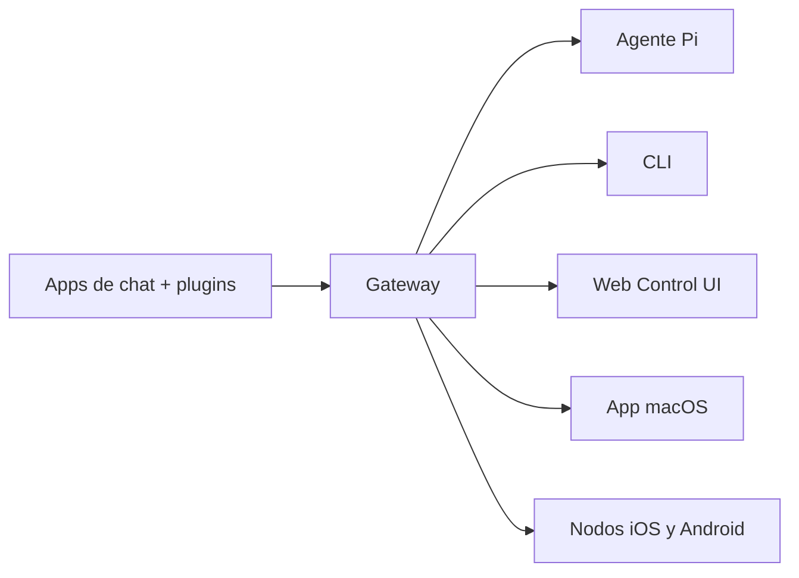

---
read_when:
  - Presentar OpenClaw a nuevos usuarios
summary: "OpenClaw es un gateway multicanal para agentes de IA que funciona en cualquier sistema operativo."
title: "OpenClaw"
x-i18n:
  generated_at: "2026-02-08T22:00:00Z"
  model: claude-sonnet-4
  provider: pi
  source_hash: 22725fdce9eafb337e9eb36958644009aa4a9f630e3a251c800cf921a987cb1c
  source_path: index.md
  workflow: 15
---

# OpenClaw 🦞

<p align="center">
    
    
</p>

> _"¡EXFOLIA! ¡EXFOLIA!"_ — Probablemente una langosta espacial

<p align="center">
  <strong>Gateway para agentes de IA en cualquier SO: WhatsApp, Telegram, Discord, iMessage y más.</strong><br />
  Envía un mensaje, recibe una respuesta del agente desde tu bolsillo. Los plugins añaden Mattermost y más.
</p>

<Columns>
  <Card title="Empezar" href="/start/getting-started" icon="rocket">
    Instala OpenClaw y levanta el Gateway en minutos.
  </Card>
  <Card title="Ejecutar el Wizard" href="/start/wizard" icon="sparkles">
    Configuración guiada con `openclaw onboard` y flujos de emparejamiento.
  </Card>
  <Card title="Abrir la Control UI" href="/web/control-ui" icon="layout-dashboard">
    Abre el panel de control en el navegador para chat, configuración y sesiones.
  </Card>
</Columns>

## ¿Qué es OpenClaw?

OpenClaw es un **gateway autoalojado** que conecta tus aplicaciones de mensajería favoritas — WhatsApp, Telegram, Discord, iMessage y más — con agentes de IA de programación como Pi. Ejecutas un único proceso Gateway en tu propia máquina (o un servidor), y se convierte en el puente entre tus apps de mensajería y un asistente de IA siempre disponible.

**¿Para quién es?** Desarrolladores y usuarios avanzados que quieren un asistente de IA personal al que puedan enviar mensajes desde cualquier lugar — sin renunciar al control de sus datos ni depender de un servicio alojado.

**¿Qué lo hace diferente?**

- **Autoalojado**: se ejecuta en tu hardware, tus reglas
- **Multicanal**: un solo Gateway sirve WhatsApp, Telegram, Discord y más simultáneamente
- **Nativo para agentes**: diseñado para agentes de coding con uso de herramientas, sesiones, memoria y enrutamiento multiagente
- **Open source**: licencia MIT, impulsado por la comunidad

**¿Qué necesitas?** Node 22+, una API key (Anthropic recomendado) y 5 minutos.

## Cómo funciona



El Gateway es la única fuente de verdad para sesiones, enrutamiento y conexiones de canales.

## Capacidades principales

<Columns>
  <Card title="Gateway multicanal" icon="network">
    WhatsApp, Telegram, Discord e iMessage con un único proceso Gateway.
  </Card>
  <Card title="Canales de plugins" icon="plug">
    Añade Mattermost y más con paquetes de extensión.
  </Card>
  <Card title="Enrutamiento multiagente" icon="route">
    Sesiones aisladas por agente, workspace o remitente.
  </Card>
  <Card title="Soporte de medios" icon="image">
    Envía y recibe imágenes, audio y documentos.
  </Card>
  <Card title="Web Control UI" icon="monitor">
    Panel de control en el navegador para chat, configuración, sesiones y nodos.
  </Card>
  <Card title="Nodos móviles" icon="smartphone">
    Empareja nodos iOS y Android con soporte Canvas.
  </Card>
</Columns>

## Inicio rápido

<Steps>
  <Step title="Instalar OpenClaw">
    ```bash
    npm install -g openclaw@latest
    ```
  </Step>
  <Step title="Onboarding e instalación del servicio">
    ```bash
    openclaw onboard --install-daemon
    ```
  </Step>
  <Step title="Emparejar WhatsApp e iniciar el Gateway">
    ```bash
    openclaw channels login
    openclaw gateway --port 18789
    ```
  </Step>
</Steps>

¿Necesitas la instalación completa y la configuración para desarrollo? Consulta [Inicio rápido](/start/quickstart).

## Dashboard

Abre la Control UI en el navegador después de iniciar el Gateway.

- Local por defecto: [http://127.0.0.1:18789/](http://127.0.0.1:18789/)
- Acceso remoto: [Interfaces web](/web) y [Tailscale](/gateway/tailscale)

<p align="center">
  
</p>

## Configuración (opcional)

La configuración se encuentra en `~/.openclaw/openclaw.json`.

- Si **no haces nada**, OpenClaw usa el binario Pi incluido en modo RPC con sesiones por remitente.
- Si quieres restringir el acceso, comienza con `channels.whatsapp.allowFrom` y (para grupos) reglas de mención.

Ejemplo:

```json5
{
  channels: {
    whatsapp: {
      allowFrom: ["+15555550123"],
      groups: { "*": { requireMention: true } },
    },
  },
  messages: { groupChat: { mentionPatterns: ["@openclaw"] } },
}
```

## Empieza aquí

<Columns>
  <Card title="Hubs de documentación" href="/start/hubs" icon="book-open">
    Toda la documentación y guías, organizadas por caso de uso.
  </Card>
  <Card title="Configuración" href="/gateway/configuration" icon="settings">
    Ajustes principales del Gateway, tokens y configuración de proveedores.
  </Card>
  <Card title="Acceso remoto" href="/gateway/remote" icon="globe">
    Patrones de acceso SSH y tailnet.
  </Card>
  <Card title="Canales" href="/channels/telegram" icon="message-square">
    Configuración específica para WhatsApp, Telegram, Discord y más.
  </Card>
  <Card title="Nodos" href="/nodes" icon="smartphone">
    Nodos iOS y Android con emparejamiento y Canvas.
  </Card>
  <Card title="Ayuda" href="/help" icon="life-buoy">
    Soluciones comunes y punto de partida para resolución de problemas.
  </Card>
</Columns>

## Más información

<Columns>
  <Card title="Lista completa de funcionalidades" href="/concepts/features" icon="list">
    Todas las capacidades de canales, enrutamiento y medios.
  </Card>
  <Card title="Enrutamiento multiagente" href="/concepts/multi-agent" icon="route">
    Aislamiento de workspaces y sesiones por agente.
  </Card>
  <Card title="Seguridad" href="/gateway/security" icon="shield">
    Tokens, allowlists y controles de seguridad.
  </Card>
  <Card title="Resolución de problemas" href="/gateway/troubleshooting" icon="wrench">
    Diagnósticos del Gateway y errores comunes.
  </Card>
  <Card title="Acerca de y créditos" href="/reference/credits" icon="info">
    Orígenes del proyecto, colaboradores y licencia.
  </Card>
</Columns>
