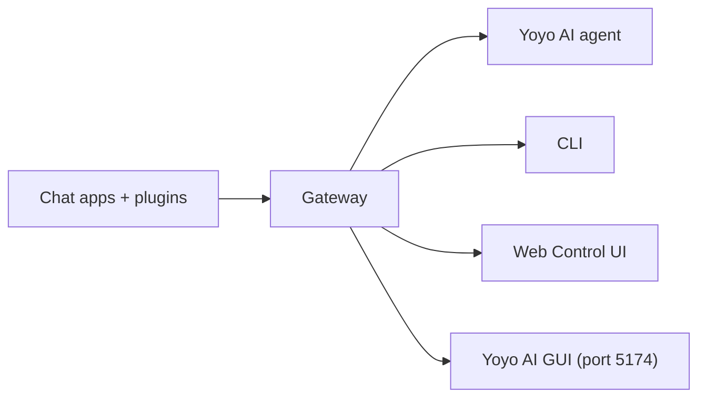

# YoyoClaw

> Local, security-hardened [OpenClaw](https://github.com/daverjorge46/yoyoclaw) fork for **Yoyo Dev AI**.

<p align="center">
  <strong>Multi-channel AI gateway across WhatsApp, Telegram, Discord, iMessage, and more.</strong><br />
  Powers the <strong>Yoyo AI</strong> Business and Personal AI Assistant.
</p>

<Columns>
  <Card title="Get Started" href="/start/getting-started" icon="rocket">
    Install and bring up the Gateway in minutes.
  </Card>
  <Card title="Run the Wizard" href="/start/wizard" icon="sparkles">
    Guided setup with onboarding and pairing flows.
  </Card>
  <Card title="Open the Control UI" href="/web/control-ui" icon="layout-dashboard">
    Launch the browser dashboard for chat, config, and sessions.
  </Card>
</Columns>

## What is YoyoClaw?

YoyoClaw is a locally-managed fork of [OpenClaw](https://github.com/daverjorge46/yoyoclaw), the open-source personal AI assistant gateway. It serves as the engine behind **Yoyo AI**, the Business and Personal AI Assistant within the Yoyo Dev AI platform.

**What YoyoClaw adds over upstream OpenClaw:**

- **Local-first architecture** -- Config home at `~/.yoyoclaw/`, no global npm install required
- **Security hardening** -- Audit logging, gateway token authentication
- **Custom extensions** -- `yoyo-dev-bridge` (spec/task/fix tools), `yoyo-memory-sync` (Claude Code memory access)
- **Custom skills** -- `yoyo/web-search`, `yoyo/token-usage`
- **Themed UI** -- Cyan/mauve palette customization
- **Default Yoyo identity** -- Warm, professional agent personality template

**Core OpenClaw capabilities (preserved):**

- **Self-hosted**: runs on your hardware, your rules
- **Multi-channel**: one Gateway serves WhatsApp, Telegram, Discord, and more simultaneously
- **Agent-native**: built for coding agents with tool use, sessions, memory, and multi-agent routing
- **Open source**: MIT licensed, community-driven

## How it works



The Gateway is the single source of truth for sessions, routing, and channel connections.

## Key capabilities

<Columns>
  <Card title="Multi-channel gateway" icon="network">
    WhatsApp, Telegram, Discord, and iMessage with a single Gateway process.
  </Card>
  <Card title="Plugin channels" icon="plug">
    Add Mattermost and more with extension packages.
  </Card>
  <Card title="Multi-agent routing" icon="route">
    Isolated sessions per agent, workspace, or sender.
  </Card>
  <Card title="Media support" icon="image">
    Send and receive images, audio, and documents.
  </Card>
  <Card title="Web Control UI" icon="monitor">
    Browser dashboard for chat, config, sessions, and nodes.
  </Card>
  <Card title="Mobile nodes" icon="smartphone">
    Pair iOS and Android nodes with Canvas support.
  </Card>
</Columns>

## Quick start

<Steps>
  <Step title="Build YoyoClaw">
    ```bash
    cd yoyoclaw && pnpm install --frozen-lockfile && pnpm build
    ```
  </Step>
  <Step title="Start the Gateway">
    ```bash
    node yoyoclaw/yoyoclaw.mjs gateway --port 18789
    ```
  </Step>
  <Step title="Pair channels">
    ```bash
    node yoyoclaw/yoyoclaw.mjs channels login
    ```
  </Step>
</Steps>

Default port: 18789. Config at `~/.yoyoclaw/yoyoclaw.json`.

## Dashboard

Open the browser Control UI after the Gateway starts.

- Local default: [http://127.0.0.1:18789/](http://127.0.0.1:18789/)
- Yoyo AI GUI: port 5174 (`yoyo-gui --ai`)
- Remote access: [Web surfaces](/web) and [Tailscale](/gateway/tailscale)

## Configuration

Config lives at `~/.yoyoclaw/yoyoclaw.json` (symlinked from `~/.yoyoclaw` and `~/.yoyo-ai`).

Example:

```json5
{
  channels: {
    whatsapp: {
      allowFrom: ["+15555550123"],
      groups: { "*": { requireMention: true } },
    },
  },
  messages: { groupChat: { mentionPatterns: ["@yoyo"] } },
}
```

## Start here

<Columns>
  <Card title="Docs hubs" href="/start/hubs" icon="book-open">
    All docs and guides, organized by use case.
  </Card>
  <Card title="Configuration" href="/gateway/configuration" icon="settings">
    Core Gateway settings, tokens, and provider config.
  </Card>
  <Card title="Remote access" href="/gateway/remote" icon="globe">
    SSH and tailnet access patterns.
  </Card>
  <Card title="Channels" href="/channels/telegram" icon="message-square">
    Channel-specific setup for WhatsApp, Telegram, Discord, and more.
  </Card>
  <Card title="Nodes" href="/nodes" icon="smartphone">
    iOS and Android nodes with pairing and Canvas.
  </Card>
  <Card title="Help" href="/help" icon="life-buoy">
    Common fixes and troubleshooting entry point.
  </Card>
</Columns>

## Learn more

<Columns>
  <Card title="Full feature list" href="/concepts/features" icon="list">
    Complete channel, routing, and media capabilities.
  </Card>
  <Card title="Multi-agent routing" href="/concepts/multi-agent" icon="route">
    Workspace isolation and per-agent sessions.
  </Card>
  <Card title="Security" href="/gateway/security" icon="shield">
    Tokens, allowlists, and safety controls.
  </Card>
  <Card title="Troubleshooting" href="/gateway/troubleshooting" icon="wrench">
    Gateway diagnostics and common errors.
  </Card>
  <Card title="Based on OpenClaw" href="https://github.com/daverjorge46/yoyoclaw" icon="info">
    Upstream project, contributors, and license.
  </Card>
</Columns>
