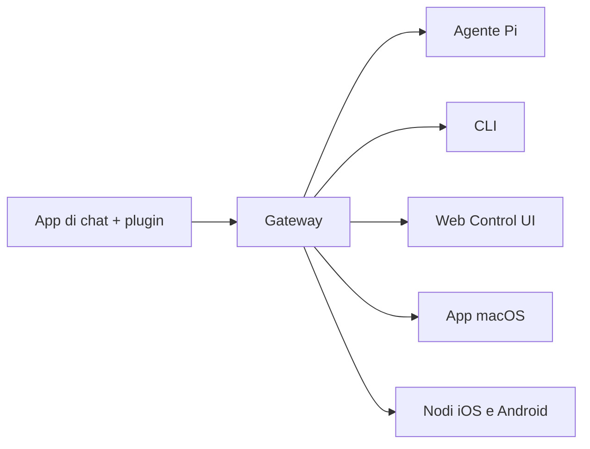

---
read_when:
  - Presentare OpenClaw a nuovi utenti
summary: "OpenClaw è un gateway multi-canale per agenti AI che funziona su qualsiasi sistema operativo."
title: "OpenClaw"
x-i18n:
  generated_at: "2026-02-08T22:00:00Z"
  model: claude-sonnet-4
  provider: pi
  source_hash: 22725fdce9eafb337e9eb36958644009aa4a9f630e3a251c800cf921a987cb1c
  source_path: index.md
  workflow: 15
---

# OpenClaw 🦞

<p align="center">
    
    
</p>

> _"ESFOLIA! ESFOLIA!"_ — Probabilmente un'aragosta spaziale

<p align="center">
  <strong>Gateway per agenti AI su qualsiasi OS: WhatsApp, Telegram, Discord, iMessage e altro.</strong><br />
  Invia un messaggio, ricevi una risposta dall'agente ovunque tu sia. I plugin aggiungono Mattermost e altro.
</p>

<Columns>
  <Card title="Inizia" href="/start/getting-started" icon="rocket">
    Installa OpenClaw e avvia il Gateway in pochi minuti.
  </Card>
  <Card title="Avvia il Wizard" href="/start/wizard" icon="sparkles">
    Configurazione guidata con `openclaw onboard` e flussi di associazione.
  </Card>
  <Card title="Apri la Control UI" href="/web/control-ui" icon="layout-dashboard">
    Avvia la dashboard nel browser per chat, configurazione e sessioni.
  </Card>
</Columns>

## Cos'è OpenClaw?

OpenClaw è un **gateway self-hosted** che collega le tue app di messaggistica preferite — WhatsApp, Telegram, Discord, iMessage e altre — ad agenti AI di programmazione come Pi. Esegui un singolo processo Gateway sulla tua macchina (o un server), e diventa il ponte tra le tue app di messaggistica e un assistente AI sempre disponibile.

**Per chi è?** Sviluppatori e utenti avanzati che vogliono un assistente AI personale raggiungibile da qualsiasi luogo — senza rinunciare al controllo dei propri dati o dipendere da un servizio hosted.

**Cosa lo rende diverso?**

- **Self-hosted**: gira sul tuo hardware, le tue regole
- **Multi-canale**: un solo Gateway serve WhatsApp, Telegram, Discord e altro contemporaneamente
- **Nativo per agenti**: progettato per agenti di coding con uso di strumenti, sessioni, memoria e routing multi-agente
- **Open source**: licenza MIT, guidato dalla comunità

**Di cosa hai bisogno?** Node 22+, una API key (Anthropic consigliato) e 5 minuti.

## Come funziona



Il Gateway è la singola fonte di verità per sessioni, routing e connessioni ai canali.

## Funzionalità principali

<Columns>
  <Card title="Gateway multi-canale" icon="network">
    WhatsApp, Telegram, Discord e iMessage con un singolo processo Gateway.
  </Card>
  <Card title="Canali plugin" icon="plug">
    Aggiungi Mattermost e altro con pacchetti di estensione.
  </Card>
  <Card title="Routing multi-agente" icon="route">
    Sessioni isolate per agente, workspace o mittente.
  </Card>
  <Card title="Supporto media" icon="image">
    Invia e ricevi immagini, audio e documenti.
  </Card>
  <Card title="Web Control UI" icon="monitor">
    Dashboard nel browser per chat, configurazione, sessioni e nodi.
  </Card>
  <Card title="Nodi mobili" icon="smartphone">
    Associa nodi iOS e Android con supporto Canvas.
  </Card>
</Columns>

## Avvio rapido

<Steps>
  <Step title="Installa OpenClaw">
    ```bash
    npm install -g openclaw@latest
    ```
  </Step>
  <Step title="Onboarding e installazione del servizio">
    ```bash
    openclaw onboard --install-daemon
    ```
  </Step>
  <Step title="Associa WhatsApp e avvia il Gateway">
    ```bash
    openclaw channels login
    openclaw gateway --port 18789
    ```
  </Step>
</Steps>

Hai bisogno dell'installazione completa e della configurazione per sviluppatori? Vedi [Avvio rapido](/start/quickstart).

## Dashboard

Apri la Control UI nel browser dopo l'avvio del Gateway.

- Predefinito locale: [http://127.0.0.1:18789/](http://127.0.0.1:18789/)
- Accesso remoto: [Interfacce web](/web) e [Tailscale](/gateway/tailscale)

<p align="center">
  
</p>

## Configurazione (opzionale)

La configurazione si trova in `~/.openclaw/openclaw.json`.

- Se **non fai nulla**, OpenClaw usa il binario Pi integrato in modalità RPC con sessioni per mittente.
- Se vuoi limitare l'accesso, inizia con `channels.whatsapp.allowFrom` e (per i gruppi) le regole di menzione.

Esempio:

```json5
{
  channels: {
    whatsapp: {
      allowFrom: ["+15555550123"],
      groups: { "*": { requireMention: true } },
    },
  },
  messages: { groupChat: { mentionPatterns: ["@openclaw"] } },
}
```

## Inizia da qui

<Columns>
  <Card title="Hub documentazione" href="/start/hubs" icon="book-open">
    Tutta la documentazione e le guide, organizzate per caso d'uso.
  </Card>
  <Card title="Configurazione" href="/gateway/configuration" icon="settings">
    Impostazioni principali del Gateway, token e configurazione provider.
  </Card>
  <Card title="Accesso remoto" href="/gateway/remote" icon="globe">
    Pattern di accesso SSH e tailnet.
  </Card>
  <Card title="Canali" href="/channels/telegram" icon="message-square">
    Configurazione specifica per WhatsApp, Telegram, Discord e altro.
  </Card>
  <Card title="Nodi" href="/nodes" icon="smartphone">
    Nodi iOS e Android con associazione e Canvas.
  </Card>
  <Card title="Aiuto" href="/help" icon="life-buoy">
    Soluzioni comuni e punto di partenza per la risoluzione dei problemi.
  </Card>
</Columns>

## Approfondimenti

<Columns>
  <Card title="Lista completa delle funzionalità" href="/concepts/features" icon="list">
    Tutte le funzionalità di canali, routing e media.
  </Card>
  <Card title="Routing multi-agente" href="/concepts/multi-agent" icon="route">
    Isolamento dei workspace e sessioni per agente.
  </Card>
  <Card title="Sicurezza" href="/gateway/security" icon="shield">
    Token, allowlist e controlli di sicurezza.
  </Card>
  <Card title="Risoluzione problemi" href="/gateway/troubleshooting" icon="wrench">
    Diagnostica del Gateway ed errori comuni.
  </Card>
  <Card title="Informazioni e crediti" href="/reference/credits" icon="info">
    Origini del progetto, contributori e licenza.
  </Card>
</Columns>
