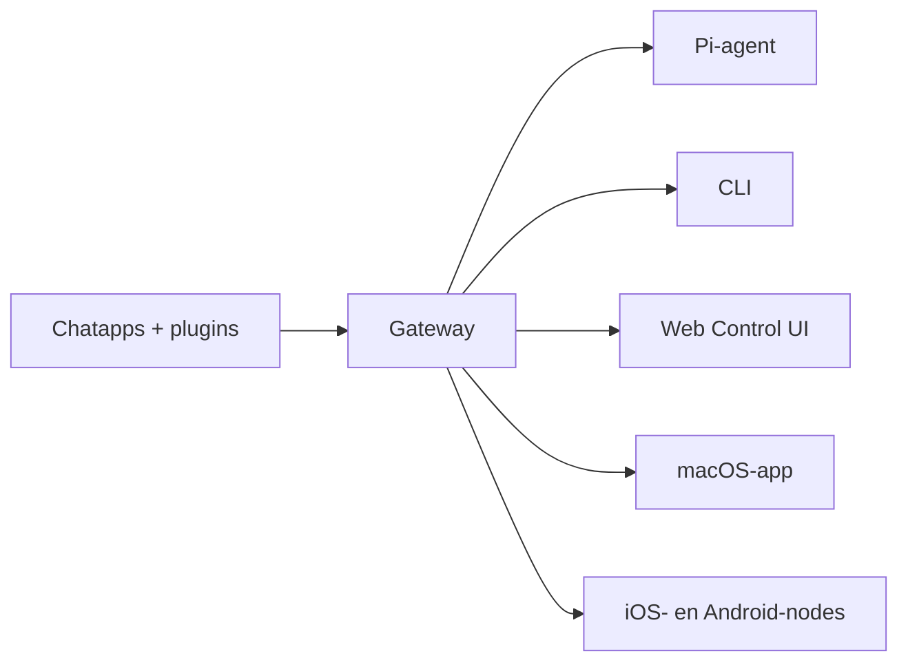

---
read_when:
  - OpenClaw voorstellen aan nieuwe gebruikers
summary: "OpenClaw is een multi-channel gateway voor AI-agents die op elk besturingssysteem draait."
title: "OpenClaw"
x-i18n:
  generated_at: "2026-02-08T22:00:00Z"
  model: claude-sonnet-4
  provider: pi
  source_hash: 22725fdce9eafb337e9eb36958644009aa4a9f630e3a251c800cf921a987cb1c
  source_path: index.md
  workflow: 15
---

# OpenClaw 🦞

<p align="center">
    
    
</p>

> _"VERVELLEN! VERVELLEN!"_ — Waarschijnlijk een ruimtekreeft

<p align="center">
  <strong>Gateway voor AI-agents op elk OS: WhatsApp, Telegram, Discord, iMessage en meer.</strong><br />
  Stuur een bericht, ontvang een antwoord van je agent waar je ook bent. Plugins voegen Mattermost en meer toe.
</p>

<Columns>
  <Card title="Aan de slag" href="/start/getting-started" icon="rocket">
    Installeer OpenClaw en start de Gateway in enkele minuten.
  </Card>
  <Card title="Start de Wizard" href="/start/wizard" icon="sparkles">
    Begeleide configuratie met `openclaw onboard` en koppelingsstappen.
  </Card>
  <Card title="Open de Control UI" href="/web/control-ui" icon="layout-dashboard">
    Open het browserdashboard voor chat, configuratie en sessies.
  </Card>
</Columns>

## Wat is OpenClaw?

OpenClaw is een **zelf-gehoste gateway** die je favoriete chatapps — WhatsApp, Telegram, Discord, iMessage en meer — verbindt met AI-codeeragenten zoals Pi. Je draait één enkel Gateway-proces op je eigen machine (of een server), en het wordt de brug tussen je berichtenapps en een altijd beschikbare AI-assistent.

**Voor wie is het?** Ontwikkelaars en gevorderde gebruikers die een persoonlijke AI-assistent willen die ze overal kunnen bereiken — zonder de controle over hun data op te geven of afhankelijk te zijn van een gehoste dienst.

**Wat maakt het anders?**

- **Zelf-gehost**: draait op je eigen hardware, jouw regels
- **Multi-channel**: één Gateway bedient WhatsApp, Telegram, Discord en meer tegelijkertijd
- **Agent-native**: gebouwd voor codeeragenten met tool-gebruik, sessies, geheugen en multi-agent routing
- **Open source**: MIT-licentie, community-gedreven

**Wat heb je nodig?** Node 22+, een API key (Anthropic aanbevolen) en 5 minuten.

## Hoe het werkt



De Gateway is de enige bron van waarheid voor sessies, routing en kanaalverbindingen.

## Belangrijkste mogelijkheden

<Columns>
  <Card title="Multi-channel gateway" icon="network">
    WhatsApp, Telegram, Discord en iMessage met één enkel Gateway-proces.
  </Card>
  <Card title="Plugin-kanalen" icon="plug">
    Voeg Mattermost en meer toe met extensiepakketten.
  </Card>
  <Card title="Multi-agent routing" icon="route">
    Geïsoleerde sessies per agent, workspace of afzender.
  </Card>
  <Card title="Media-ondersteuning" icon="image">
    Verstuur en ontvang afbeeldingen, audio en documenten.
  </Card>
  <Card title="Web Control UI" icon="monitor">
    Browserdashboard voor chat, configuratie, sessies en nodes.
  </Card>
  <Card title="Mobiele nodes" icon="smartphone">
    Koppel iOS- en Android-nodes met Canvas-ondersteuning.
  </Card>
</Columns>

## Snelstart

<Steps>
  <Step title="Installeer OpenClaw">
    ```bash
    npm install -g openclaw@latest
    ```
  </Step>
  <Step title="Onboarding en service-installatie">
    ```bash
    openclaw onboard --install-daemon
    ```
  </Step>
  <Step title="Koppel WhatsApp en start de Gateway">
    ```bash
    openclaw channels login
    openclaw gateway --port 18789
    ```
  </Step>
</Steps>

Heb je de volledige installatie en ontwikkelaarsconfiguratie nodig? Zie [Snelstart](/start/quickstart).

## Dashboard

Open de Control UI in de browser nadat de Gateway is gestart.

- Lokale standaard: [http://127.0.0.1:18789/](http://127.0.0.1:18789/)
- Externe toegang: [Web-interfaces](/web) en [Tailscale](/gateway/tailscale)

<p align="center">
  
</p>

## Configuratie (optioneel)

De configuratie bevindt zich in `~/.openclaw/openclaw.json`.

- Als je **niets doet**, gebruikt OpenClaw de meegeleverde Pi-binary in RPC-modus met sessies per afzender.
- Als je de toegang wilt beperken, begin dan met `channels.whatsapp.allowFrom` en (voor groepen) vermeldingsregels.

Voorbeeld:

```json5
{
  channels: {
    whatsapp: {
      allowFrom: ["+15555550123"],
      groups: { "*": { requireMention: true } },
    },
  },
  messages: { groupChat: { mentionPatterns: ["@openclaw"] } },
}
```

## Begin hier

<Columns>
  <Card title="Documentatiehubs" href="/start/hubs" icon="book-open">
    Alle documentatie en handleidingen, georganiseerd per gebruiksscenario.
  </Card>
  <Card title="Configuratie" href="/gateway/configuration" icon="settings">
    Belangrijkste Gateway-instellingen, tokens en providerconfiguratie.
  </Card>
  <Card title="Externe toegang" href="/gateway/remote" icon="globe">
    SSH- en tailnet-toegangspatronen.
  </Card>
  <Card title="Kanalen" href="/channels/telegram" icon="message-square">
    Kanaalspecifieke configuratie voor WhatsApp, Telegram, Discord en meer.
  </Card>
  <Card title="Nodes" href="/nodes" icon="smartphone">
    iOS- en Android-nodes met koppeling en Canvas.
  </Card>
  <Card title="Hulp" href="/help" icon="life-buoy">
    Veelvoorkomende oplossingen en startpunt voor probleemoplossing.
  </Card>
</Columns>

## Meer informatie

<Columns>
  <Card title="Volledige functionaliteitenlijst" href="/concepts/features" icon="list">
    Complete kanaal-, routing- en mediamogelijkheden.
  </Card>
  <Card title="Multi-agent routing" href="/concepts/multi-agent" icon="route">
    Workspace-isolatie en sessies per agent.
  </Card>
  <Card title="Beveiliging" href="/gateway/security" icon="shield">
    Tokens, allowlists en beveiligingsmaatregelen.
  </Card>
  <Card title="Probleemoplossing" href="/gateway/troubleshooting" icon="wrench">
    Gateway-diagnostiek en veelvoorkomende fouten.
  </Card>
  <Card title="Over en credits" href="/reference/credits" icon="info">
    Projectoorsprong, bijdragers en licentie.
  </Card>
</Columns>
