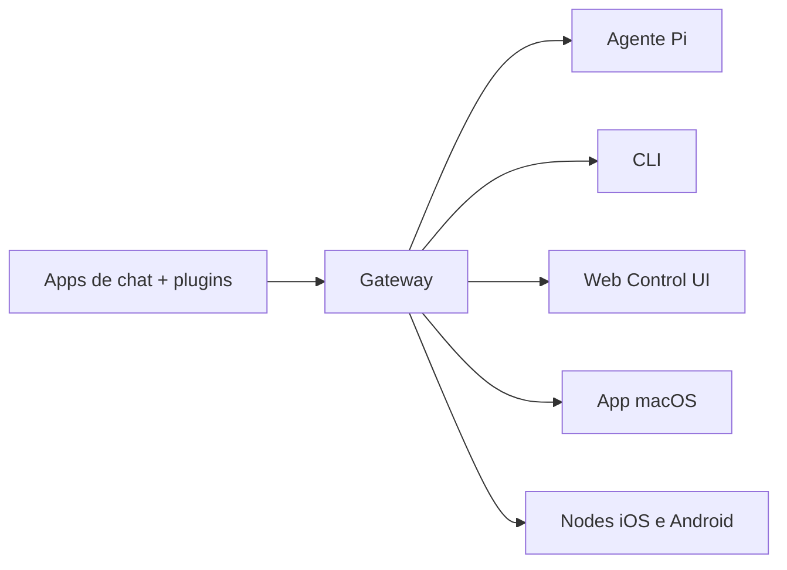

---
read_when:
  - Apresentar OpenClaw a novos usuários
summary: "OpenClaw é um gateway multicanal para agentes de IA que roda em qualquer sistema operacional."
title: "OpenClaw"
x-i18n:
  generated_at: "2026-02-08T22:00:00Z"
  model: claude-sonnet-4
  provider: pi
  source_hash: 22725fdce9eafb337e9eb36958644009aa4a9f630e3a251c800cf921a987cb1c
  source_path: index.md
  workflow: 15
---

# OpenClaw 🦞

<p align="center">
    
    
</p>

> _"DESCASCA! DESCASCA!"_ — Provavelmente uma lagosta espacial

<p align="center">
  <strong>Gateway para agentes de IA em qualquer SO: WhatsApp, Telegram, Discord, iMessage e mais.</strong><br />
  Envie uma mensagem, receba uma resposta do agente de qualquer lugar. Plugins adicionam Mattermost e mais.
</p>

<Columns>
  <Card title="Primeiros Passos" href="/start/getting-started" icon="rocket">
    Instale o OpenClaw e inicie o Gateway em poucos minutos.
  </Card>
  <Card title="Iniciar o Wizard" href="/start/wizard" icon="sparkles">
    Configuração guiada com `openclaw onboard` e fluxos de pareamento.
  </Card>
  <Card title="Abrir a Control UI" href="/web/control-ui" icon="layout-dashboard">
    Abra o dashboard no navegador para chat, configuração e sessões.
  </Card>
</Columns>

## O que é o OpenClaw?

OpenClaw é um **gateway auto-hospedado** que conecta seus apps de mensagem favoritos — WhatsApp, Telegram, Discord, iMessage e mais — a agentes de IA de programação como o Pi. Você executa um único processo Gateway na sua própria máquina (ou servidor), e ele se torna a ponte entre seus apps de mensagem e um assistente de IA sempre disponível.

**Para quem é?** Desenvolvedores e usuários avançados que querem um assistente de IA pessoal que podem contactar de qualquer lugar — sem abrir mão do controle dos seus dados ou depender de um serviço hospedado.

**O que o torna diferente?**

- **Auto-hospedado**: roda no seu hardware, suas regras
- **Multicanal**: um único Gateway atende WhatsApp, Telegram, Discord e mais simultaneamente
- **Nativo para agentes**: construído para agentes de coding com uso de ferramentas, sessões, memória e roteamento multiagente
- **Open source**: licença MIT, impulsionado pela comunidade

**O que você precisa?** Node 22+, uma API key (Anthropic recomendado) e 5 minutos.

## Como funciona



O Gateway é a única fonte de verdade para sessões, roteamento e conexões de canais.

## Principais funcionalidades

<Columns>
  <Card title="Gateway multicanal" icon="network">
    WhatsApp, Telegram, Discord e iMessage com um único processo Gateway.
  </Card>
  <Card title="Canais via plugins" icon="plug">
    Adicione Mattermost e mais com pacotes de extensão.
  </Card>
  <Card title="Roteamento multiagente" icon="route">
    Sessões isoladas por agente, workspace ou remetente.
  </Card>
  <Card title="Suporte a mídia" icon="image">
    Envie e receba imagens, áudio e documentos.
  </Card>
  <Card title="Web Control UI" icon="monitor">
    Dashboard no navegador para chat, configuração, sessões e nodes.
  </Card>
  <Card title="Nodes móveis" icon="smartphone">
    Pareie nodes iOS e Android com suporte a Canvas.
  </Card>
</Columns>

## Início rápido

<Steps>
  <Step title="Instale o OpenClaw">
    ```bash
    npm install -g openclaw@latest
    ```
  </Step>
  <Step title="Onboarding e instalação do serviço">
    ```bash
    openclaw onboard --install-daemon
    ```
  </Step>
  <Step title="Pareie o WhatsApp e inicie o Gateway">
    ```bash
    openclaw channels login
    openclaw gateway --port 18789
    ```
  </Step>
</Steps>

Precisa da instalação completa e configuração para desenvolvedores? Veja [Início rápido](/start/quickstart).

## Dashboard

Abra a Control UI no navegador após iniciar o Gateway.

- Padrão local: [http://127.0.0.1:18789/](http://127.0.0.1:18789/)
- Acesso remoto: [Interfaces web](/web) e [Tailscale](/gateway/tailscale)

<p align="center">
  
</p>

## Configuração (opcional)

A configuração fica em `~/.openclaw/openclaw.json`.

- Se você **não fizer nada**, o OpenClaw usa o binário Pi embutido no modo RPC com sessões por remetente.
- Se quiser restringir o acesso, comece com `channels.whatsapp.allowFrom` e (para grupos) regras de menção.

Exemplo:

```json5
{
  channels: {
    whatsapp: {
      allowFrom: ["+15555550123"],
      groups: { "*": { requireMention: true } },
    },
  },
  messages: { groupChat: { mentionPatterns: ["@openclaw"] } },
}
```

## Comece aqui

<Columns>
  <Card title="Hubs de documentação" href="/start/hubs" icon="book-open">
    Toda a documentação e guias, organizados por caso de uso.
  </Card>
  <Card title="Configuração" href="/gateway/configuration" icon="settings">
    Configurações principais do Gateway, tokens e configuração de providers.
  </Card>
  <Card title="Acesso remoto" href="/gateway/remote" icon="globe">
    Padrões de acesso SSH e tailnet.
  </Card>
  <Card title="Canais" href="/channels/telegram" icon="message-square">
    Configuração específica para WhatsApp, Telegram, Discord e mais.
  </Card>
  <Card title="Nodes" href="/nodes" icon="smartphone">
    Nodes iOS e Android com pareamento e Canvas.
  </Card>
  <Card title="Ajuda" href="/help" icon="life-buoy">
    Soluções comuns e ponto de partida para resolução de problemas.
  </Card>
</Columns>

## Saiba mais

<Columns>
  <Card title="Lista completa de funcionalidades" href="/concepts/features" icon="list">
    Todas as funcionalidades de canais, roteamento e mídia.
  </Card>
  <Card title="Roteamento multiagente" href="/concepts/multi-agent" icon="route">
    Isolamento de workspaces e sessões por agente.
  </Card>
  <Card title="Segurança" href="/gateway/security" icon="shield">
    Tokens, allowlists e controles de segurança.
  </Card>
  <Card title="Resolução de problemas" href="/gateway/troubleshooting" icon="wrench">
    Diagnóstico do Gateway e erros comuns.
  </Card>
  <Card title="Sobre e créditos" href="/reference/credits" icon="info">
    Origem do projeto, contribuidores e licença.
  </Card>
</Columns>
